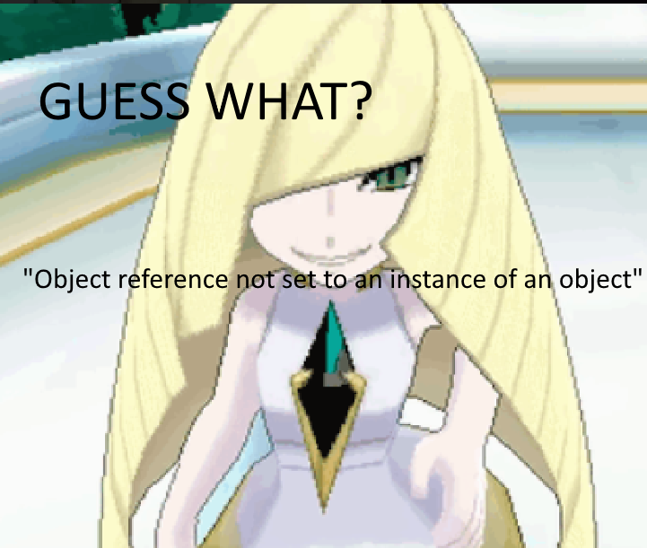

# Sabotage
Sussy gussy popup wirus, with the CTF part removed for common clownery

Made this for a CTF earlier. Good for pranks n' stuff, but don't use it for actual malware.
It's probably not sneaky enough for that, anyway. Plus, it doesn't even limit itself, and
crashes if it opens too many windows. We didn't really focus on making it hard to get rid
of for the CTF, but maybe I'll work on that later.

## And now, it's time for Kid Named Comrade's favorite error!

